# Lab 0: Setting up the lab environment

## Exercise 1: Assign Power Apps trial license

1.  Open a web browser on your VM and go
    to [**https://powerapps.microsoft.com/en-us/free/**](urn:gd:lg:a:send-vm-keys)

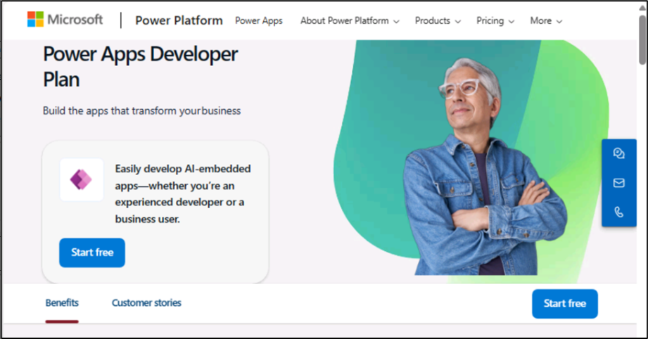

2.  Select **Start free**.

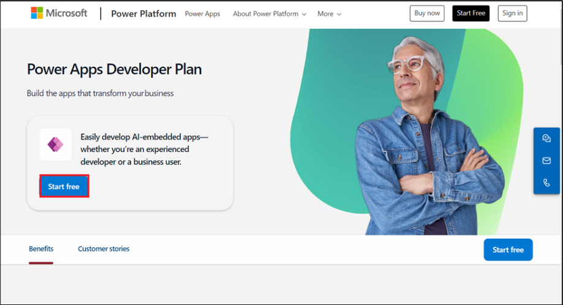

3.  Enter your Office 365 admin credential, check the checkbox to accept
    the agreement and click on **Start your free trial**.

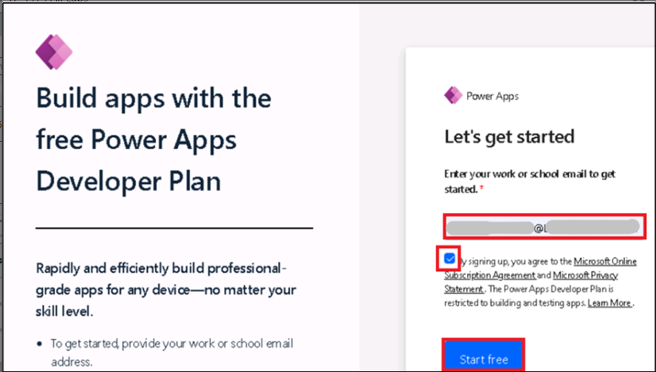

**Note:** Check that you have entered admin credential correctly. While
pasting, you may miss some characters then you need to enter them
manually.

4.  Select **Yes** on **Stay signed-in** window.

5.  Provide **Contact Information** as below and then select **Submit**.

Email: **Office 365 admin tenant credentials**

Country/region: **United States**

Phone number: **Your phone number**

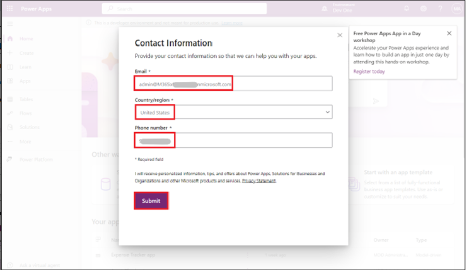

6.  You can now see **Home page of Power Apps** and the developer
    environment - **Dev One** is created for you.

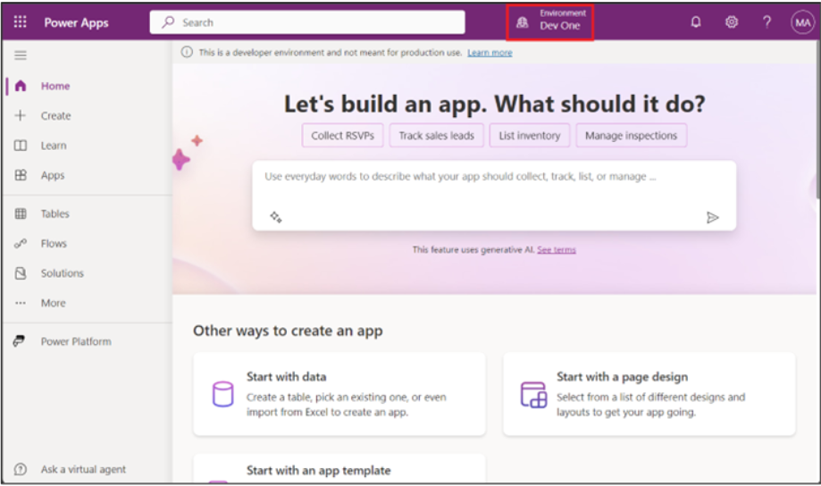

7.  Open the new tab and go to Power Platform admin center by navigating
    to [**https://admin.powerplatform.microsoft.com**](urn:gd:lg:a:send-vm-keys) and
    if required, sign in using your given Office 365 tenant admin
    credentials. **Close** the **Pop-up window** saying, ‘Welcome to the
    Power Platform admin center’.

8.  From the left navigation pane, select **Environments** and then you
    can see, **Dev One** is your Dataverse environment.

9.  You can now proceed to the next exercise.

## Exercise 2: Create a team in Microsoft Teams and enable Transcription in Teams

### Task 1: Create a team in Microsoft Teams

1.  Sign into the Microsoft Teams
    using [**https://teams.microsoft.com/**](urn:gd:lg:a:send-vm-keys) with
    your Office 365 tenant credentials.

2.  On Welcome to Teams window, select **Get Started**. Close the window
    which asks for scanning QR code.

3.  On the left side of Teams, click **Teams**, at the bottom of the
    teams list, click **+** to **Join or create a team**.

4.  Click on **Create team**.

5.  Enter the Team name – [**Test Team**](urn:gd:lg:a:send-vm-keys),
    name the first channel as **TestChannel** and Click on **Private**.

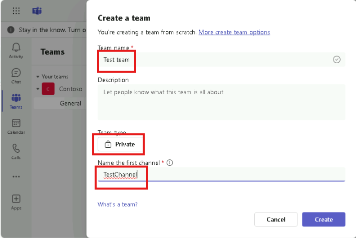

- Select **Org-wide**.

- Select **Create**.

6.  You can view the channel in teams when added.

### Task 2: Enable Transcription in Teams

1.  Sign-in to the **Microsoft Teams admin
    center** [**https://admin.teams.microsoft.com/dashboard**](urn:gd:lg:a:send-vm-keys).

2.  From the left navigation pane, select **Meetings \> Meeting
    policies**.

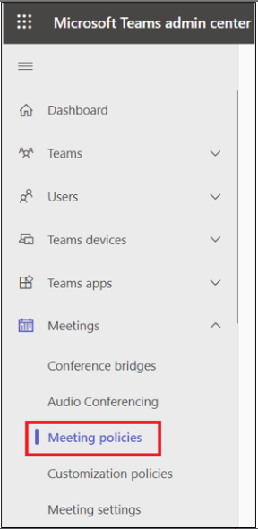

3.  Select **Global (Org-wide default) policy** under **Manage
    policies** tab.

4.  Under **Recording and transcription** section,
    toggle **Transcription** button to **On** and then select **Save**.

5.  Select **Confirm** to make changes.

6.  From the left navigation pane, select **Live events
    policies** under **Meetings**. Select **Global (Org-wide default)
    policy**.

7.  Toggle the button for **Transcription for attendees** to **On** and
    then select **Save**.

8.  Select **Confirm** to make changes.

9.  From the left navigation pane, under **Voice**, select **Calling
    policies**. Select **Global (Org-wide default) policy**.

10. Toggle **Transcription** to **On** and then select **Save**.

11. From the left navigation pane, under **Voice**, select **Voicemail
    policies**. Select **Global (Org-wide default) policy**.

12. Toggle **Mask profanity in voicemail transcription** to **On** and
    then select **Save**.

13. Select **Confirm** to make changes.

## Exercise 3: Assign Customer Service trial license and enable Copilot

### Task 1: Assign Customer Service trial license

1.  Open your browser and browse
    to [**https://dynamics.microsoft.com/en-in/customer-service/overview/**](urn:gd:lg:a:send-vm-keys) and
    select **Try for free**.

2.  Enter your **Office 365 admin tenant credentials**, select the
    checkbox to **accept the agreement** and click on **Start your free
    trial**.

3.  Provide **Contact Information** as below and then select **Submit**.

- Country/region: **United States**

- Phone number: **Your phone number**

4.  If asked, enter your **Office 365 admin tenant password**.

5.  If the pop up appears, then click **Launch Trial**. Ignore, if
    ‘Launch Trial’ does not appear.

6.  You will be landed on the **Customer Service Workspace portal**.

7.  Go to **Power Platform admin center** by navigating
    to [**https://admin.powerplatform.microsoft.com/**](urn:gd:lg:a:send-vm-keys) and
    if required, sign in using your given **Office 365 tenant
    admin** credentials. You can see, **Customer Service Trial
    environment** is created.

### Task 2: Enable Copilot feature

1.  Navigate back to **Customer Service workspace portal**.
    Select **Customer Service workspace** at the top.

2.  Under **Apps**, select **Customer Service Admin Center**.

3.  Select **Productivity** under **Agent experience**.

4.  In the **Productivity Pane**, select **Manage** for the **Copilot
    for questions and emails**.

5.  First check the checkbox under **Knowledge sources** for **Include
    your organization’s knowledge base or SharePoint site as a source**
    then check the checkbox for **Ask a question**, **Suggest a
    response** and **Help pane – write an email**. Scroll down, check
    the checkbox for **Let agents translate responses** under
    **Translation**.  

6.  Select **Save and close**.

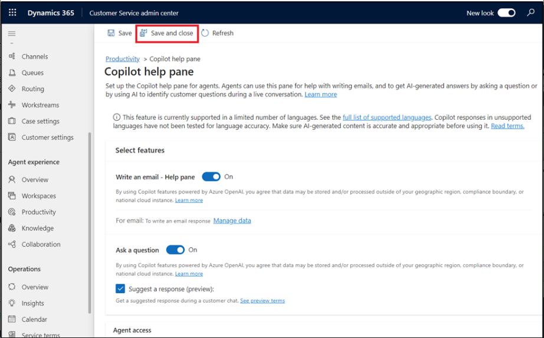

7.  Select **Manage** for **Summaries**.

8.  If asked, provide your consent to use Copilot and then select **Opt
    in** to continue with the setup.

9.  Select **Make case summaries available to agents** check box, select
    all the check boxes under **Live conversation summaries** and then
    select **Save**.

## Exercise 4: Assign Field Service trial license and install the Field Service Outlook Add-in

### Task 1: Assign Field Service trial license

1.  Navigate to the **Field Service product page** using the given
    link [**https://www.microsoft.com/en-us/dynamics-365/products/field-service**](urn:gd:lg:a:send-vm-keys) and
    select the **Try for free** button.

2.  If you are navigated to the **Dynamics 365 free trials** page,
    select **Dynamics 365 Field Service** and click **Try for free**
    else go to the next step.  

3.  Enter your **Office 365 admin tenant username**, select the checkbox
    for service agreement and then select **Start your free trial**.

4.  Provide **Contact Information** as below and then select **Submit**.

    - Country/region: **United States**

    - Phone number: **Your phone number**

5.  If pop-up that says ‘Launch trial’ appears then click **Launch
    Trial**. Or if Pop-up regarding ‘Whats new’ appears, close it. 

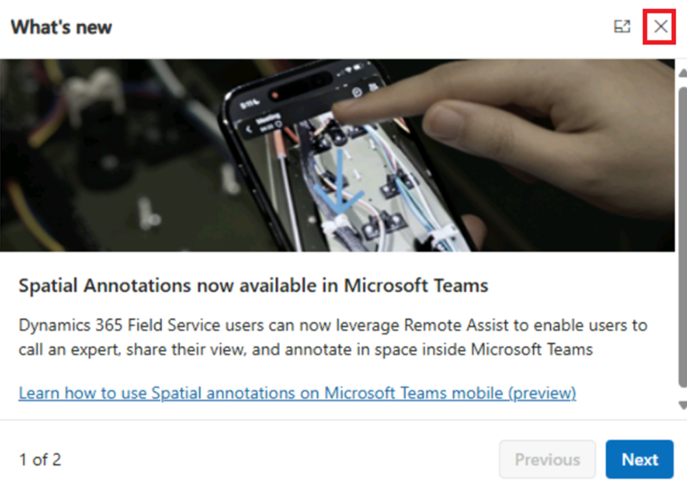

6.  You will be navigated to the **Dynamics 365 Field Service portal**.

7.  Go to **Power Platform admin center** by navigating
    to [**https://admin.powerplatform.microsoft.com/**](urn:gd:lg:a:send-vm-keys) and
    if required, sign in using your given **Office 365 tenant
    admin** credentials. You can see, **Field Service Trial
    environment** is created.

### Task 2: Install Field Service Outlook Add-in with Copilot

1.  Navigate to !!admin.microsoft.com!! and under **Settings,** click on
    **Integrated apps**.

> 

2.  Scroll down, click on **Get apps.** and search for field service  

3.  In the search box, enter **Field service** and then click on **Get
    it now** under **Dynamics 365 Field Service for Outlook,** and
    confirm your information. 

4.  You will be navigated to **Microsoft Admin center \> Integrated
    Apps**. On the **Assign users** page, select **Entire
    organization** and then select **Next**.

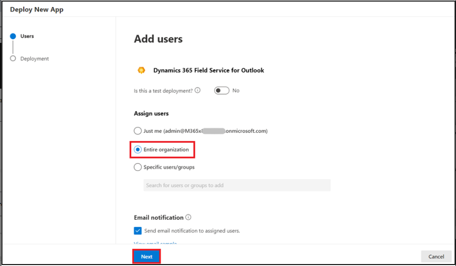

5.  On the **Accept permission requests** page, select **Accept
    permissions**.

6.  Sign in with your **Office 365 admin tenant** credentials on the
    pop-up window.

7.  Select **Next** on the **Accept permission requests** page.

8.  On the **Review and finish deployment** page, select **Finish
    deployment**.

9.  Select **Done** once the deployment is completed.

It can take up to six hours for the app to appear in Outlook.

## Exercise 5: Get Sales Copilot trial license and install Sales Copilot add-in for Outlook

### Task 1: Sign up for a free Dynamics 365 Sales trial

1.  Go to the **Sales overview** page using the given
    URL [**https://www.microsoft.com/en-us/dynamics-365/products/sales**](urn:gd:lg:a:send-vm-keys) and
    select **Try for free**.

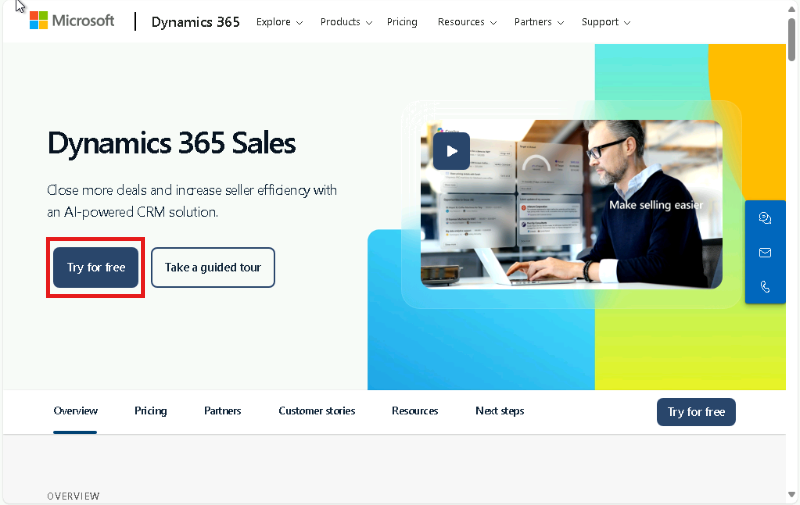

2.  On the **Dynamics 365 free trials** page, select **Dynamics 365
    Sales** and click **Try for free**.

3.  Enter your **Office 365 admin tenant** credentials, select the
    checkbox to **accept the agreement** and click on **Start your free
    trial**.

4.  Provide **Contact Information** as below and then select Submit.

- **Country/region**: United States

- **Phone number**: Your phone number

5.  If asked, enter your **Office 365 admin tenant** password.

6.  Select **Launch trial** if the pop-up window appears.

7.  You will be landed on the **Dynamics 365 Sales** portal.

8.  Go to **Power Platform admin center** by navigating
    to [**https://admin.powerplatform.microsoft.com**](urn:gd:lg:a:send-vm-keys) and
    if required, sign in using your given Office 365 tenant admin
    credentials. You can see, **Sales Trial environment** is created.

### Task 2: Install Sales Copilot add-in for Outlook

1.  Sign in to the **Microsoft 365 admin center** with the given
    link [**https://admin.microsoft.com/**](urn:gd:lg:a:send-vm-keys).

2.  In the left pane, select **Settings \> Integrated apps**.

3.  On the **Integrated apps** page, select **Get apps**. **Microsoft
    AppSource** opens in an embedded window.

4.  In the **AppSource** window, search for **Copilot for sales**.

5.  In the search results, select **Copilot for Sales**, and then
    select **Get it now**.

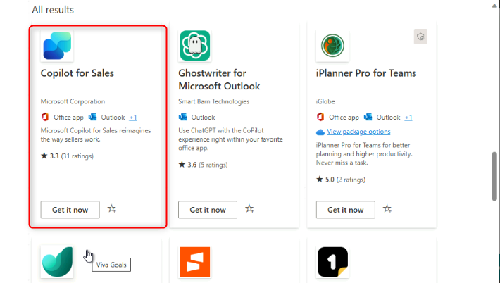

6.  On **the Confirm to continue** page, select **Get it now**.

7.  In the **Configuration** step, select **Next** on **Apps to deploy
    window**.

8.  In the **Add Users** step, select **Entire
    organization** under **Assign users**, and then select **Next**.

9.  In the **Deployment (Permissions)** step, read the app permissions
    and capabilities for the app to be deployed, select **Accept
    permissions** for **Copilot for Sales**.

10. Sign in with your **Office 365 admin tenant** credentials on the
    pop-up window.

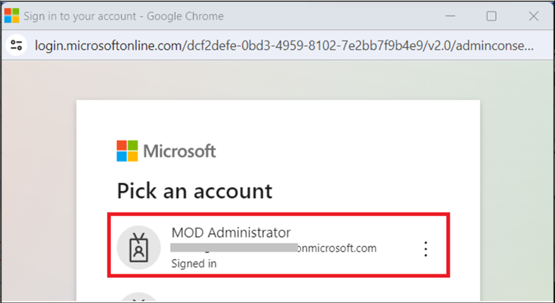

11. Select **Next** on the **Accept permission requests** page.

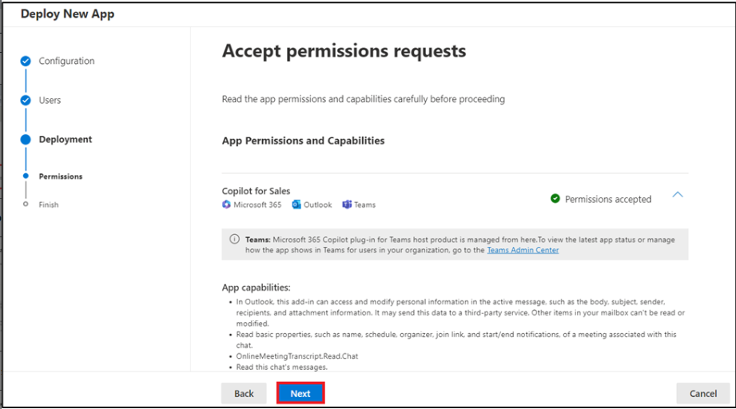

12. In the **Deployment (Finish)** step, review the selected settings,
    and then select **Finish deployment**.

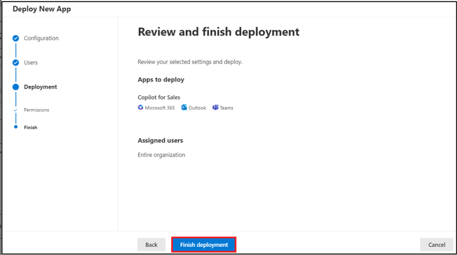

13. When the deployment is complete, select **Done**.

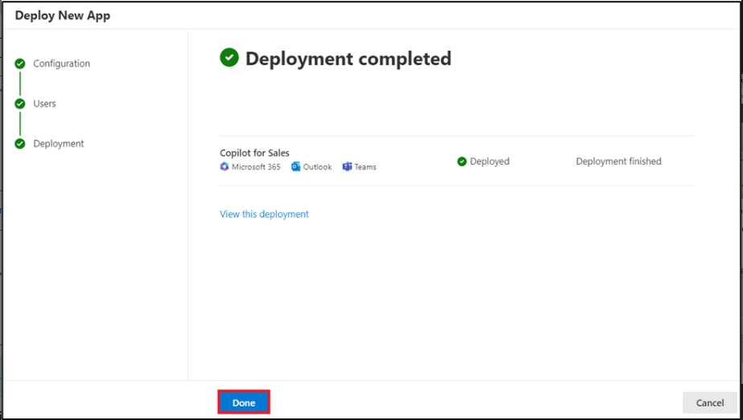

Allow up to six hours for Sales Copilot to appear in users' Outlook
ribbon.

## Exercise 6: Sign up for the trial and give consent to use Copilot in Customer Insights - Data

### Task 1: Sign up for the trial

1.  Go
    to [**https://dynamics.microsoft.com/en-us/ai/customer-insights/**](urn:gd:lg:a:send-vm-keys)  choose
    the **Try for free** button.

2.  Enter your **Office 365 admin credentials**, check the checkbox
    to **accept the agreement** and click on **Start your free trial**.

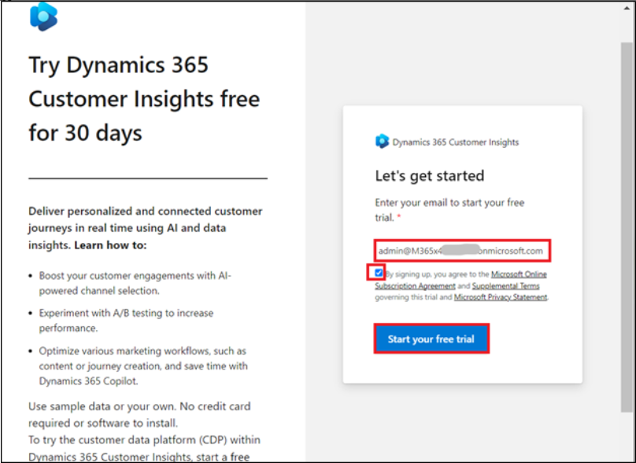

3.  Enter your **password** of Office 365 admin tenant.

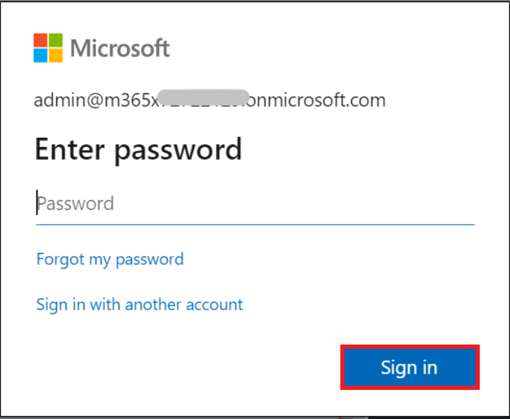

4.  Select **Yes** on the ‘**Stay signed in?**' window.

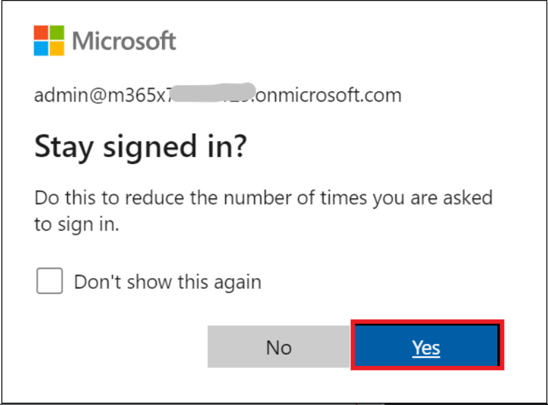

5.  Select **United States** for **Country/region** field, enter
    your **Phone number** and then select **Submit**.

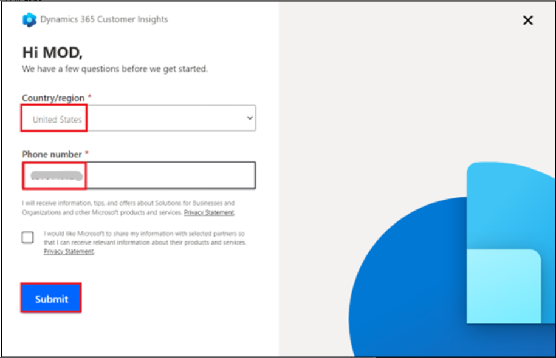

**Note:** If the Launch trail pop up appears, then click on the Launch
trail button

6.  Choose **Start Customer Insights - Data.**

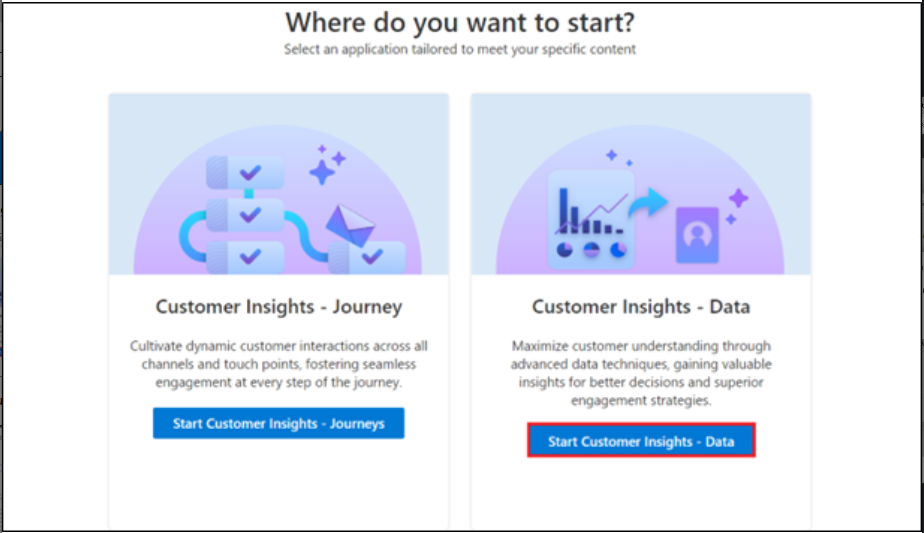

7.  Select **United States** for **Country/region** field and then
    select **Continue**.

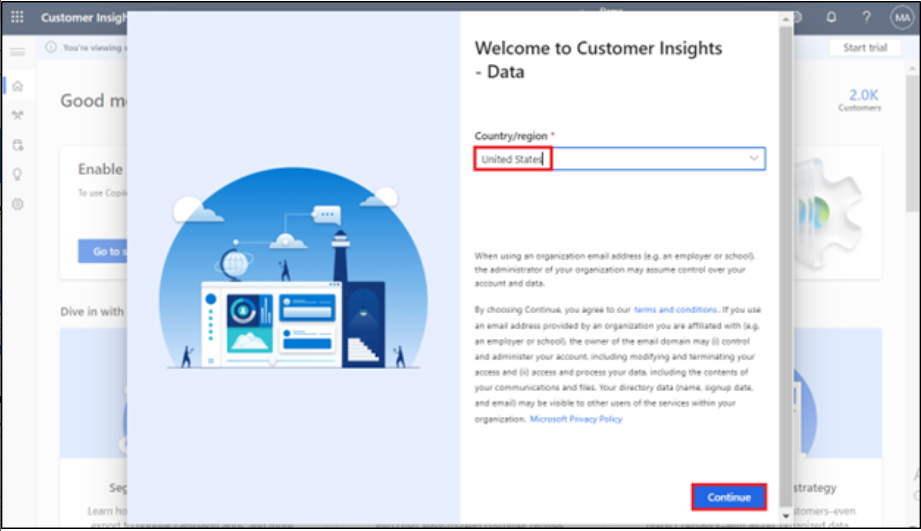

8.  Select **Start trial** from the top right corner.

9.  On the **Basic information** page, enter [**Marketing
    Trial**](urn:gd:lg:a:send-vm-keys) in the **Name** field,
    select **United States** for the **Region** field, and then
    select **Next**. Or it may start creating environment directly and
    in that case see step no 13 directly.

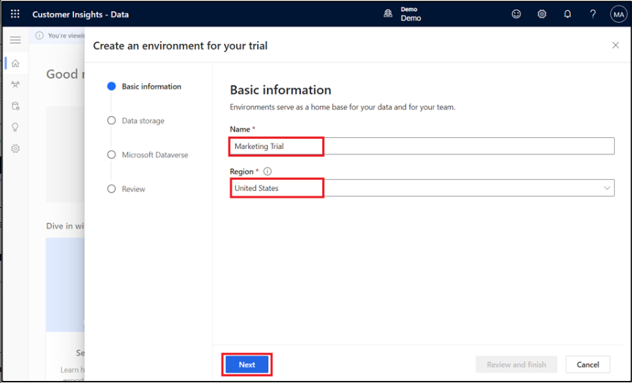

10. Select **Next** on the **Data storage** page.

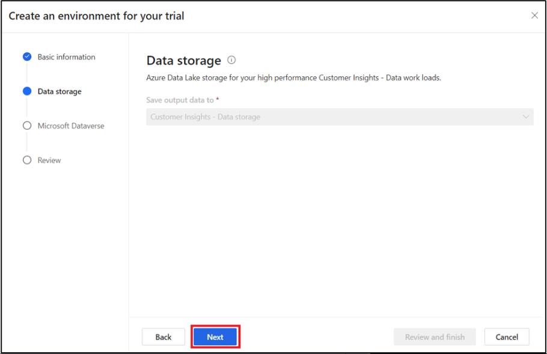

11. Select your **Dataverse environment** – **Marketing Trial** and then
    click **Next**.

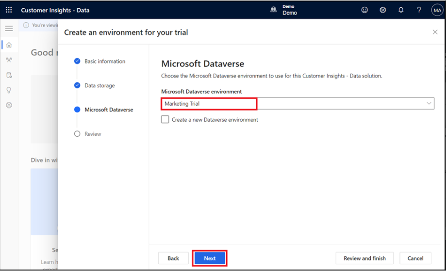

12. Review the information on the **Review** page and then
    select **Create**.

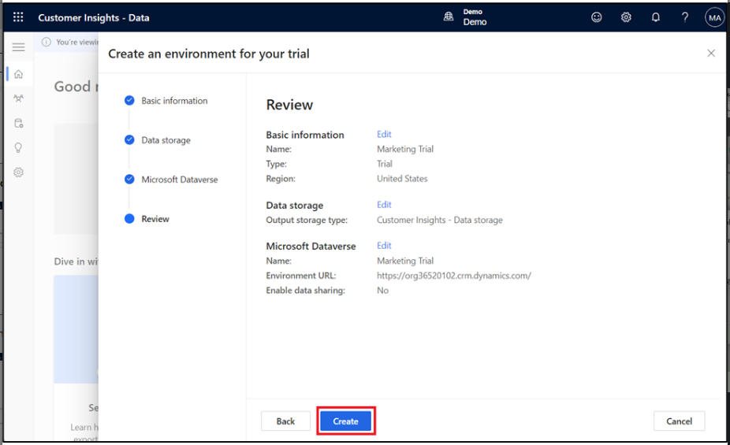

13. It may take some time to create your environment.

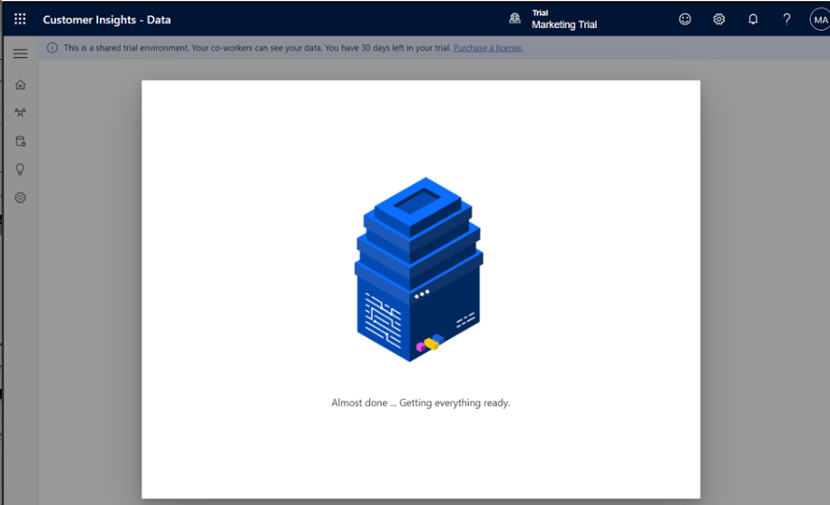

14. You can now see that your environment is named **Marketing Trial**.

### Task 2: Give consent to use Copilot in Customer Insights - Data

1.  Go to **Settings** \> **System**.

2.  Select the **Consent** tab.

3.  **Enable** the **Enable Copilot features powered by Azure
    OpenAI** and then select **Save**.

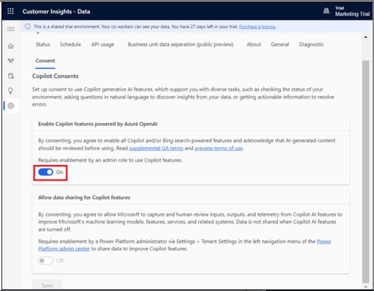

Note: It may take some time for the app to appear in Customer Service -
Data portal.
