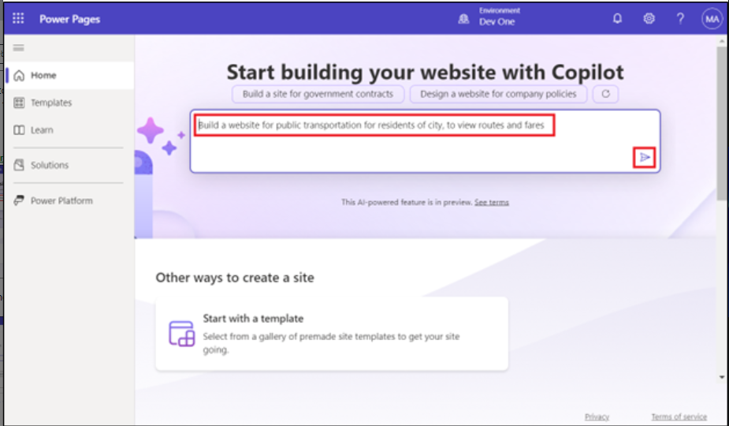
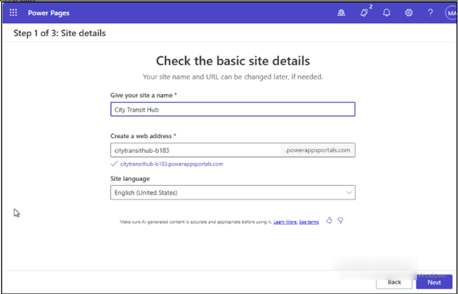
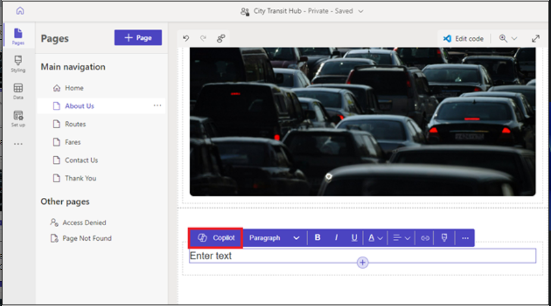

# Lab 5: Creating an AI-generated site, webpage using Copilot (preview) and adding other components to pages

**Note:** When creating a Power Pages website using Copilot, it is
important to note that Copilot may generate a different template or
layout each time the website is created. As a result:

\- The exact layout and design of the generated website may vary from
one instance to another.

\- While following the creation steps in guides or tutorials, use them
as a reference rather than expecting identical results.

\- The screenshots provided may differ from what you see in your
instance due to Copilot's dynamic generation capabilities.

**Tip**: Focus on understanding the overall process and concepts rather
than replicating the exact design, as the core functionality and steps
will remain consistent.

## Exercise 1: Create a site with the help of AI

To use Copilot for site creation:

1.  Go to Power Pages
    using [**https://make.powerpages.microsoft.com/**](urn:gd:lg:a:send-vm-keys)

2.  Ensure that, you are in Developer environment - **Dev One** and then
    click on **Get started**.

3.  Select **Skip** on **Tell us about yourself window**.

4.  Now, you will be navigated to home page of the Power Pages portal.
    Enter a description of the site you want to build or select a
    suggested description of the site. And then, press the Enter key or
    select the paper airplane icon in the lower-right corner of the text
    box.

Example description:

- [**Build a website for public transportation for residents of city, to
  view routes and fares.**](urn:gd:lg:a:send-vm-keys)

5.  Copilot generates a site name and a web address based on your
    description. Keep the suggested name and web address as is and
    select **Next**.

> 

6.  On ‘Choose a layout page’, select **Next**. Then, on ‘add common
    pages’ page, select all web pages then click on Done. On the
    Introducing Copilot in power pages click **Next** and lastly
    select **Done**.

7.  Click on Enable copilot and on the next page of Add copilot to site
    page toggle on the Enable copilot on site

### Exercise 2: Create an AI-generated webpage using Copilot (**preview**)

### Task 1: Generate a webpage

To use Copilot to generate a webpage:

1.  From the left navigation pane, select **Pages** workspace and then
    you will be on home page of your newly created website

2.  Initially you will be on the **Pages** workspace.

3.  Select the Copilot button in the command bar, if the Copilot panel
    is not open already.

• Type a description of your webpage in the Choose a starter prompt,
request an action, or ask a question text field.

Sample descriptions:

- [**Create a Thank you for visiting our site
webpage**](urn:gd:lg:a:send-vm-keys)

To complete page review, select **Keep it**.

After the page is generated, it's added to the main navigation, and you
can review the page and the content. Sections, text, and images in the
page are low-code editable using the WYSIWYG editor.

## Exercise 3: Add an AI-generated form using Copilot (preview)

### Task 1: Create a form with Copilot

1.  Go to the **Pages workspace** and select a **Routes** page for your
    form.

2.  Hover the mouse over first section of the Routes webpage and then
    click on **+ Add a section** \> **1Column**.

3.  Select **More** and then select **Form** component.

4.  In the text box under Describe a form to create it, describe your
    form. You can use up to 250 characters in your description. To send
    your description to Copilot, press the Enter key or select the paper
    airplane icon in the lower-right corner of the text box.

**Example**: [**Create a form for collecting suggestions and
addition/deletion of the routes**](urn:gd:lg:a:send-vm-keys)

**Note:** You can check the preview to the right of your description and
refine the form as needed.

- To change the form, select a quick action or refine your description.

- The history shows you the descriptions you've entered so far.

- Select **Start over** to erase everything and start with a new
  description.

5.  To add the form to the page, select **OK**.

### Task 2: Add an AI-generated multistep form using Copilot (preview)

To use Copilot to generate a multistep form:

1.  Go to the **Pages workspace** and choose a **Thank you** page for
    your form.

2.  Go to the bottom of the Thank you page and click on the Add section
    and select 1 Column.

> 

3.  In choose component section. Click on the (…) and then select Form.

> 
>
> After the form is generated, a preview of the form displays on the
> canvas, and the **Review this form** toolbar displays at the bottom of
> the canvas.
>
> Review each step. Then decide if you want to keep the form or discard
> it. If you choose to add the form to the page, you can edit it using
> design studio's existing functionality just as you would for other
> components.

4.  After selecting Form, Enter the given below Prompt in the Describe
    section then then click on the send.

> [**create a multistep form for getting information of a specific route
> and the fare.**](urn:gd:lg:a:send-vm-keys)
>
> 

5.  Click on the ok button to add the form in the page.

> 

### Task 3: Generate text with Copilot

1.  Go to the **Pages workspace** and select **About Us** page for your
    form.

2.  Hover the mouse over the page and select **+Add a
    section** \> **1Column** under Our Services section.

3.  Select the **Text** component.

4.  In the text component toolbar, select the **Copilot** icon.

5.  Describe the text that you want to Copilot to generate; for example,
    " [**I want to describe importance of local
    transport**](urn:gd:lg:a:send-vm-keys)". You can use up to 1,500
    characters in your description. To send your description to Copilot,
    press the Enter key or select the paper airplane icon in the
    lower-right corner of the text box.

6.  Check the **preview** below your description and refine the text as
    needed.

    - To refine your description and generate new text,
      select **Rewrite**.

    - To keep the generated text but make it sound more friendly,
      casual, educational, professional, or excited, select **Change the
      tone**.

    - To keep the generated text but make it more concise or expand on
      it, select **Adjust the length**.

    - To give Copilot more information, select **Add more details for
      Copilot to work with**.

    - To give Microsoft feedback on how well Copilot interpreted your
      description or refinement, select the thumbs-up or thumbs-down
      icon.

7.  To add the text to the page, select **Add to page**.

### Task 4: Testing your site

1.  Select **Preview**, followed by **Desktop**. If asked sign in with
    admin credentials and check the **checkbox of the consent** and
    select **Accept**.

2.  You can see the home page and the list of other webpages.

3.  Select Router page. You can observe the AI-generated form.

4.  Fill up the few fields of the form and then select **Submit** button
    at the end of the form.

5.  Check the **checkbox of the consent** and select **Accept**.

6.  Once you've successfully submitted the form, return to the design
    studio.

**Note**: Try one more time if you don't get message of successful
submission.

7.  Select **Data**, then select the **Copilot Suggestion Routes** table
    (table name can differ) and confirm that you can see that records
    were created using the multistep form process.

